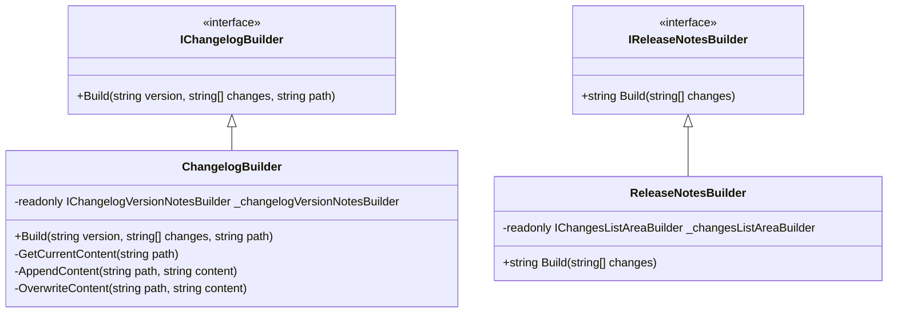
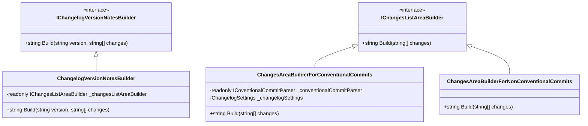

import { CaptionDocusaurus, ShareDocusaurus } from '@cangulo-blog/components'
import BrowserWindow from '/src/components/BrowserWindow'
import Tabs from '@theme/Tabs'
import TabItem from '@theme/TabItem'

First of all, let me refresh the main goals we have: 
* Update the Changelog 
* Create the release notes. 

I have defined an interface for each goal:
* `IReleaseNotesBuilder`
  * Create the release notes using the `IChangesListAreaBuilder` interface.
* `IChangelogBuilder`
  * If there is a changelog, it adds the changes provided at first.
  * If there is not, it is created.

:::info Interactive Diagram 😁
Click on the next diagram classes and interfaces to open its definition
::: 

<i>
  <CaptionDocusaurus label="Main interfaces" />
</i>

In order to have reusable classes between both processes. I implemented the following classes for the MD operations:

* `IChangelogVersionNotesBuilder`: 
  * Class that builds a Changelog Section with the changes provided.
  * Called by the IChangelogBuilder. 
  * Use all the MD classes to build the Changelog.
* `IChangesListAreaBuilder`: 
  * Receives a list of changes (commit messages) and creates a list in MD format. 
  * Called by IChangelogVersionNotesBuilder and IReleaseNotesBuilder.

As I want to be able to support both commits types (Conventional and Non Conventional), I have two implementations for the IChangesListAreaBuilder:

* `ChangesAreaBuilderForConventionalCommits`
  * It groups the commits received by type.
* `ChangesAreaBuilderForNonConventionalCommits`
  * It simply lists the commits received

<i>
  <CaptionDocusaurus label="Main interfaces" />
</i>

<!-- TODO: Add two tabs with the different output -->
<!-- TODO: Add two tabs with the different output -->

---

<ShareDocusaurus 
  slug="docs/implementation" 
  title="cangulo.changelog - Idea and how I use it" 
  tags={["nuke", "cicd", "cangulo.changelog","conventional_commits", "changelog"]} />
